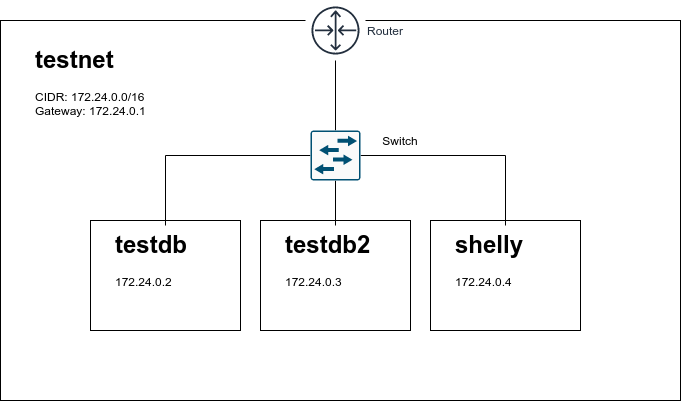

# Understanding Networks

This exercise will give us some of the network basics we need to understand how subnets and TCP/IP networks work. Docker will allow
us to do this quickly without the need for spinning up cloud resources.

<!-- TOC -->

- [Understanding Networks](#understanding-networks)
    - [Setup](#setup)
    - [Internal Subnet Communication](#internal-subnet-communication)
    - [External Subnet communication](#external-subnet-communication)

<!-- /TOC -->

## Setup

Before we begin, lets see a network diagram example of what we will be building:



In a terminal, run:

```shell
$ docker network create -d bridge --subnet 172.24.0.0/16 --gateway 172.24.0.1/16 testnet
```

This will create a bridge network with the subnet ID of 172.24.0.0/16 and a default gateway of 172.24.0.1/16. The default gateway
serves to route traffic to IPs that are not destined for our local host. We'll test this concept later on.

Now that we have created our network, lets inspect it with docker:

```shell
$ docker network inspect testnet
[
    {
        "Name": "testnet",
        "Id": "a499305f3b5c4b6e6d75d031db8d55e6dc3b586963cf6dbf869ab27e549e9cfe",
        "Created": "2020-10-21T00:37:49.747632275-05:00",
        "Scope": "local",
        "Driver": "bridge",
        "EnableIPv6": false,
        "IPAM": {
            "Driver": "default",
            "Options": {},
            "Config": [
                {
                    "Subnet": "172.24.0.0/16",
                    "Gateway": "172.24.0.1"
                }
            ]
        },
        "Internal": false,
        "Attachable": false,
        "Ingress": false,
        "ConfigFrom": {
            "Network": ""
        },
        "ConfigOnly": false,
        "Containers": {},
        "Options": {},
        "Labels": {}
    }
]
```

You might be wondering what IPAM is. It stands for IP Adress Management. By default, when we create new containers on this network, docker will assign an IP address from the range we gave above and give this container a network interface with that IP. Let's test it out
by creating a few postgres containers on this network:

```shell
$ docker run -d --net testnet --name testdb -e POSTGRES_HOST_AUTH_METHOD=trust postgres:12-alpine
```

and 

```shell
$ docker run -d --net testnet --name othertestdb -e POSTGRES_HOST_AUTH_METHOD=trust postgres:12-alpine
```

Now, inspecting the network, we can see that we have a new container on our network:

```shell
$ docker network inspect testnet                                                                 
[
    {
        "Name": "testnet",
        "Id": "a499305f3b5c4b6e6d75d031db8d55e6dc3b586963cf6dbf869ab27e549e9cfe",
        "Created": "2020-10-21T00:37:49.747632275-05:00",
        "Scope": "local",
        "Driver": "bridge",
        "EnableIPv6": false,
        "IPAM": {
            "Driver": "default",
            "Options": {},
            "Config": [
                {
                    "Subnet": "172.24.0.0/16",
                    "Gateway": "172.24.0.1"
                }
            ]
        },
        "Internal": false,
        "Attachable": false,
        "Ingress": false,
        "ConfigFrom": {
            "Network": ""
        },
        "ConfigOnly": false,
        "Containers": {
            "b0036ec84a9df889da33d3ec2088d0a2175c58fd2030670c5bc075861fcc4378": {
                "Name": "testdb",
                "EndpointID": "5ab88f15cefd4d98f20142d5d72fb728c1038d15c7205d2a1a5f6d3f79c040fe",
                "MacAddress": "02:42:ac:18:00:02",
                "IPv4Address": "172.24.0.2/16",
                "IPv6Address": ""
            },
            "b828eae3b7077c6baf0e4fbccdfaf406c55d8205c2d2f9077c5a612971c8b798": {
                "Name": "othertestdb",
                "EndpointID": "50a5bcda60c66c09fc48b3deff44bca2f0bd4a4cdc082c80496ab615eae71c16",
                "MacAddress": "02:42:ac:18:00:03",
                "IPv4Address": "172.24.0.3/16",
                "IPv6Address": ""
            }
        },
        "Options": {},
        "Labels": {}
    }
]

```

In this case, our postgres instances have been assigned the IP address `172.24.0.2` and `172.24.0.3`. Next, we'll spin up an container on the network that we can interact with in order to familiarize ourselves with some more concepts.

```shell
$ docker run --rm -it --net testnet --name shelly busybox
/# 
```

Now we are in a shell inside the newly created shelly container. Let's learn about the following concepts by running commands in this container:


## Internal Subnet Communication

First, let's have a look at the ARP table, by running:

```shell
/ # arp -a
/ #
```

And we'll notice that the arp table is empty. Our docker container does not know about any hosts on the local network! Lets change that, by pinging one of our database hosts.

```shell
/ # ping 172.24.0.2 -q -w 10
PING 172.24.0.2 (172.24.0.2): 56 data bytes

--- 172.24.0.2 ping statistics ---
11 packets transmitted, 10 packets received, 9% packet loss
round-trip min/avg/max = 0.075/0.085/0.098 ms
```

This command sends out ICMP echo requests to our `testdb` container. Let's check back in on our ARP table again:

```shell
/ # arp -a
testdb.testnet (172.24.0.2) at 02:42:ac:18:00:02 [ether]  on eth0
```

Now we can see that our docker container knows the MAC address(`02:42:ac:18:00:02`) for our `testdb`. Since we are on the same subnet, communication will happen via layer 2 addressing(MAC addresses).

You can confirm this is the case, by running `traceroute` and seeing that the communication was direct
and in fact, we have not added any new addresses to our ARP table.

```shell
/ # traceroute 172.24.0.2
traceroute to 172.24.0.2 (172.24.0.2), 30 hops max, 46 byte packets
 1  testdb.testnet (172.24.0.2)  0.006 ms  0.007 ms  0.005 ms
/ # arp -a
testdb.testnet (172.24.0.2) at 02:42:ac:18:00:02 [ether]  on eth0
```

## External Subnet communication

Next, we'll look at how a host communicates with addresses external to its subnet. Let's run the following:

```shell
/ # ping google.com -q -w 10
PING google.com (172.217.0.14): 56 data bytes

--- google.com ping statistics ---
11 packets transmitted, 10 packets received, 9% packet loss
round-trip min/avg/max = 17.064/18.448/20.799 ms
```

For the time being, we'll ignore that this command had to make a DNS request in order to resolve `google.com` to an IP address. Checking our ARP table again, we can see we have a new entry:

```
/ # arp -a
testdb.testnet (172.24.0.2) at 02:42:ac:18:00:02 [ether]  on eth0
? (172.24.0.1) at 02:42:0b:cf:8e:31 [ether]  on eth0
```

We recognize `172.24.0.1` as the gateway IP we provided earlier in the setup. Because our container determined that that the destination IP was not in our subnet(It does not match `172.24.x.x`), it had
to forward those packets to the default gateway(`172.24.0.1`). Since that address is on our local network,
we need to talk to it via its MAC address, resulting in an ARP-request(who has `172.24.0.1`) and the response from the default gateway having `02:24:0b:cf:8e:31`.